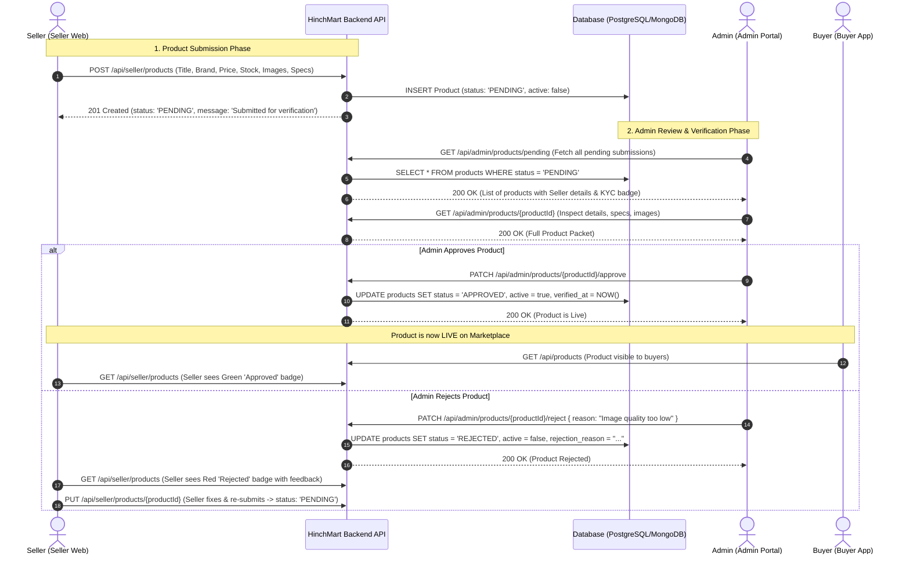

# HinchMart — Seller Product Submission & Admin Verification API Specification

**Target Audience:** Admin Portal Developers, Backend Engineers, and System Architects  
**Client Applications:** HinchMart Seller Web (`src/services/sellerProduct.service.js`) & HinchMart Admin Portal  
**Base URL:** `https://api.hinchmart.com/v1` (Configurable via `VITE_API_BASE_URL`)  
**Authentication:** Bearer JWT Token (`Authorization: Bearer <token>`)  
**Standard:** RESTful JSON Envelope Specification

---

## 1. End-to-End Workflow & Architecture



---

## 2. Product Status Lifecycle & State Machine

| Status Code | Display Name | `active` | Seller Web Action | Admin Action | Marketplace Visibility |
| :--- | :--- | :--- | :--- | :--- | :--- |
| `PENDING` | Pending Review | `false` | Can view, edit, or delete | Can view, Approve, or Reject | **Hidden** |
| `APPROVED` | Approved | `true` | Can edit price, stock, specs | Can revoke / deactivate | **Visible (Live)** |
| `REJECTED` | Rejected | `false` | Can edit and re-submit | Can view rejection history | **Hidden** |
| `ARCHIVED` | Archived | `false` | Can restore to Pending | Can view | **Hidden** |

---

## 3. Seller Endpoints (Used by Seller Web)

These endpoints are already integrated in `src/services/sellerProduct.service.js`. The backend must implement the matching endpoints below:

### 3.1 Create Product (Submit for Admin Verification)
*Submits a new product to the marketplace. Automatically assigned `status: "PENDING"`.*

- **Method:** `POST`
- **Endpoint:** `/api/seller/products`
- **Headers:** `Authorization: Bearer <seller_token>`
- **Request Body (JSON):**
```json
{
  "title": "Ambuja Cement PPC 50kg",
  "sku": "AMB-PPC-50KG",
  "description": "High-strength Portland Pozzolana Cement for structural foundation and concrete works.",
  "categoryId": 1,
  "categoryName": "Civil & Structural",
  "subcategoryId": 101,
  "subcategoryName": "Cement & Concrete",
  "brandId": 5,
  "brandName": "Ambuja Cement",
  "sellingPrice": 385.00,
  "mrp": 420.00,
  "unit": "BAG",
  "moq": 50,
  "stockQty": 500,
  "is24HourDelivery": true,
  "images": [
    "https://storage.hinchmart.com/products/ambuja-ppc-1.jpg",
    "https://storage.hinchmart.com/products/ambuja-ppc-2.jpg"
  ],
  "bulkPricingTiers": [
    { "minQty": 50, "maxQty": 199, "price": 385.00, "discount": 0 },
    { "minQty": 200, "maxQty": 499, "price": 370.00, "discount": 3.9 },
    { "minQty": 500, "maxQty": null, "price": 355.00, "discount": 7.8 }
  ],
  "specifications": {
    "Grade": "PPC",
    "Standard Compliance": "IS 1489 (Part 1)",
    "Packaging": "HDPE Moisture-Resistant Bag",
    "Shelf Life": "90 Days"
  }
}
```

- **Response `201 Created`:**
```json
{
  "success": true,
  "message": "Product submitted successfully. Pending Admin verification.",
  "data": {
    "id": "sp_987654321",
    "productId": "sp_987654321",
    "sellerId": "seller_001",
    "title": "Ambuja Cement PPC 50kg",
    "sku": "AMB-PPC-50KG",
    "description": "High-strength Portland Pozzolana Cement for structural foundation and concrete works.",
    "categoryId": 1,
    "categoryName": "Civil & Structural",
    "subcategoryId": 101,
    "subcategoryName": "Cement & Concrete",
    "brandId": 5,
    "brandName": "Ambuja Cement",
    "sellingPrice": 385.00,
    "mrp": 420.00,
    "unit": "BAG",
    "moq": 50,
    "stockQty": 500,
    "is24HourDelivery": true,
    "images": [
      "https://storage.hinchmart.com/products/ambuja-ppc-1.jpg",
      "https://storage.hinchmart.com/products/ambuja-ppc-2.jpg"
    ],
    "bulkPricingTiers": [
      { "minQty": 50, "maxQty": 199, "price": 385.00, "discount": 0 },
      { "minQty": 200, "maxQty": 499, "price": 370.00, "discount": 3.9 },
      { "minQty": 500, "maxQty": null, "price": 355.00, "discount": 7.8 }
    ],
    "specifications": {
      "Grade": "PPC",
      "Standard Compliance": "IS 1489 (Part 1)",
      "Packaging": "HDPE Moisture-Resistant Bag",
      "Shelf Life": "90 Days"
    },
    "status": "PENDING",
    "approvalStatus": "Pending",
    "active": false,
    "rejectionReason": null,
    "createdAt": "2026-09-04T10:00:00.000Z",
    "updatedAt": "2026-09-04T10:00:00.000Z"
  }
}
```

---

### 3.2 List Authenticated Seller's Products
*Returns only products belonging to the calling seller. Includes approval status badges.*

- **Method:** `GET`
- **Endpoint:** `/api/seller/products`
- **Headers:** `Authorization: Bearer <seller_token>`
- **Query Parameters:**
  - `page`: Integer (default: 1)
  - `limit`: Integer (default: 20)
  - `status`: `All` | `PENDING` | `APPROVED` | `REJECTED`
  - `category`: Category ID or Name
  - `brand`: Brand ID or Name
  - `search`: Keyword matching Title, SKU, Brand
  - `sortBy`: `newest` | `oldest` | `price-asc` | `price-desc` | `stock-asc` | `stock-desc`

- **Response `200 OK`:**
```json
{
  "success": true,
  "data": [
    {
      "id": "sp_987654321",
      "productId": "sp_987654321",
      "sellerId": "seller_001",
      "title": "Ambuja Cement PPC 50kg",
      "sku": "AMB-PPC-50KG",
      "category": "Civil & Structural",
      "subcategory": "Cement & Concrete",
      "brand": "Ambuja Cement",
      "sellingPrice": 385.00,
      "mrp": 420.00,
      "unit": "BAG",
      "moq": 50,
      "stockQty": 500,
      "is24HourDelivery": true,
      "images": [
        "https://storage.hinchmart.com/products/ambuja-ppc-1.jpg"
      ],
      "status": "PENDING",
      "approvalStatus": "Pending",
      "active": false,
      "createdAt": "2026-09-04T10:00:00.000Z"
    }
  ],
  "pagination": {
    "page": 1,
    "limit": 20,
    "totalRecords": 1,
    "totalPages": 1
  }
}
```

---

### 3.3 Update / Re-submit Product
*Seller edits product details or re-submits a previously rejected product.*

- **Method:** `PUT`
- **Endpoint:** `/api/seller/products/{id}`
- **Headers:** `Authorization: Bearer <seller_token>`
- **Behavior:** If product was `REJECTED`, updating it automatically changes status back to `PENDING` for Admin re-verification.

---

## 4. Admin Verification Endpoints (For Admin Portal & Backend)

The Admin Portal uses these endpoints to review, approve, and reject seller products.

### 4.1 List Pending Products for Admin Verification
*Fetches all products across all sellers requiring verification.*

- **Method:** `GET`
- **Endpoint:** `/api/admin/products/pending`
- **Headers:** `Authorization: Bearer <admin_token>`
- **Query Parameters:**
  - `page`: Integer (default: 1)
  - `limit`: Integer (default: 20)
  - `sellerId`: Filter by specific seller
  - `categoryId`: Filter by category
  - `search`: Search product title, SKU, or seller company name

- **Response `200 OK`:**
```json
{
  "success": true,
  "data": [
    {
      "id": "sp_987654321",
      "sellerId": "seller_001",
      "seller": {
        "id": "seller_001",
        "companyName": "Tata Infra Supplies Pvt Ltd",
        "contactName": "Rajesh Sharma",
        "mobileNumber": "9876543210",
        "email": "rajesh@tatainfra.com",
        "gstin": "27AABCT1332L1Z5",
        "kycStatus": "VERIFIED"
      },
      "title": "Ambuja Cement PPC 50kg",
      "sku": "AMB-PPC-50KG",
      "category": "Civil & Structural",
      "subcategory": "Cement & Concrete",
      "brand": "Ambuja Cement",
      "sellingPrice": 385.00,
      "mrp": 420.00,
      "unit": "BAG",
      "moq": 50,
      "stockQty": 500,
      "images": [
        "https://storage.hinchmart.com/products/ambuja-ppc-1.jpg",
        "https://storage.hinchmart.com/products/ambuja-ppc-2.jpg"
      ],
      "bulkPricingTiers": [
        { "minQty": 50, "maxQty": 199, "price": 385.00, "discount": 0 },
        { "minQty": 200, "maxQty": 499, "price": 370.00, "discount": 3.9 }
      ],
      "specifications": {
        "Grade": "PPC",
        "Standard Compliance": "IS 1489 (Part 1)"
      },
      "status": "PENDING",
      "createdAt": "2026-09-04T10:00:00.000Z"
    }
  ],
  "pagination": {
    "page": 1,
    "limit": 20,
    "totalPending": 12,
    "totalPages": 1
  }
}
```

---

### 4.2 Inspect Full Product Verification Packet
*Fetches single product details along with seller profile, compliance, and verification history.*

- **Method:** `GET`
- **Endpoint:** `/api/admin/products/{id}`
- **Headers:** `Authorization: Bearer <admin_token>`

- **Response `200 OK`:**
```json
{
  "success": true,
  "data": {
    "id": "sp_987654321",
    "sellerId": "seller_001",
    "seller": {
      "companyName": "Tata Infra Supplies Pvt Ltd",
      "gstin": "27AABCT1332L1Z5",
      "mobileNumber": "9876543210",
      "kycStatus": "VERIFIED"
    },
    "title": "Ambuja Cement PPC 50kg",
    "sku": "AMB-PPC-50KG",
    "description": "High-strength Portland Pozzolana Cement...",
    "categoryName": "Civil & Structural",
    "subcategoryName": "Cement & Concrete",
    "brandName": "Ambuja Cement",
    "sellingPrice": 385.00,
    "mrp": 420.00,
    "unit": "BAG",
    "moq": 50,
    "stockQty": 500,
    "images": [
      "https://storage.hinchmart.com/products/ambuja-ppc-1.jpg"
    ],
    "bulkPricingTiers": [
      { "minQty": 50, "maxQty": 199, "price": 385.00 }
    ],
    "specifications": {
      "Grade": "PPC",
      "Standard Compliance": "IS 1489 (Part 1)"
    },
    "status": "PENDING",
    "verificationHistory": []
  }
}
```

---

### 4.3 Approve Product (Go Live)
*Admin verifies product specifications, images, and price. Product goes LIVE immediately on HinchMart Buyer marketplace.*

- **Method:** `PATCH`
- **Endpoint:** `/api/admin/products/{id}/approve`
- **Headers:** `Authorization: Bearer <admin_token>`
- **Request Body (Optional overrides):**
```json
{
  "notes": "Verified against IS 1489 specifications and verified distributor price."
}
```

- **Response `200 OK`:**
```json
{
  "success": true,
  "message": "Product successfully approved and published live.",
  "data": {
    "id": "sp_987654321",
    "status": "APPROVED",
    "approvalStatus": "Approved",
    "active": true,
    "verifiedBy": "admin_user_01",
    "verifiedAt": "2026-09-04T10:15:00.000Z"
  }
}
```

---

### 4.4 Reject Product (With Reason)
*Admin rejects product submission. Status becomes `REJECTED`, and the seller is notified to correct the data.*

- **Method:** `PATCH`
- **Endpoint:** `/api/admin/products/{id}/reject`
- **Headers:** `Authorization: Bearer <admin_token>`
- **Request Body (Required):**
```json
{
  "reason": "Image is blurry and missing IS certification certificate. Please re-upload clear packaging photo.",
  "rejectionCategory": "INVALID_IMAGE" 
}
```

- **Response `200 OK`:**
```json
{
  "success": true,
  "message": "Product has been rejected. Seller notified.",
  "data": {
    "id": "sp_987654321",
    "status": "REJECTED",
    "approvalStatus": "Rejected",
    "active": false,
    "rejectionReason": "Image is blurry and missing IS certification certificate. Please re-upload clear packaging photo.",
    "rejectedBy": "admin_user_01",
    "rejectedAt": "2026-09-04T10:15:00.000Z"
  }
}
```

---

### 4.5 Bulk Product Verification
*Allows Admin to approve or reject multiple products in one operation.*

- **Method:** `POST`
- **Endpoint:** `/api/admin/products/bulk-verify`
- **Headers:** `Authorization: Bearer <admin_token>`
- **Request Body:**
```json
{
  "action": "APPROVE", 
  "productIds": ["sp_987654321", "sp_987654322", "sp_987654323"],
  "reason": "Batch verified for Q3 cement catalogue"
}
```

- **Response `200 OK`:**
```json
{
  "success": true,
  "message": "3 products processed successfully.",
  "data": {
    "approvedCount": 3,
    "failedCount": 0
  }
}
```

---

## 5. Database Schema Recommendation (PostgreSQL & MongoDB)

### 5.1 PostgreSQL Table DDL (`products` table)
```sql
CREATE TYPE product_status_enum AS ENUM ('PENDING', 'APPROVED', 'REJECTED', 'ARCHIVED');

CREATE TABLE products (
    id VARCHAR(64) PRIMARY KEY,
    seller_id VARCHAR(64) NOT NULL REFERENCES sellers(id) ON DELETE CASCADE,
    title VARCHAR(255) NOT NULL,
    sku VARCHAR(100) NOT NULL,
    description TEXT,
    category_id INT NOT NULL,
    subcategory_id INT NOT NULL,
    brand_id INT NOT NULL,
    selling_price NUMERIC(12, 2) NOT NULL,
    mrp NUMERIC(12, 2) NOT NULL,
    unit VARCHAR(30) NOT NULL DEFAULT 'PCS',
    moq INT NOT NULL DEFAULT 1,
    stock_qty INT NOT NULL DEFAULT 0,
    is_24hour_delivery BOOLEAN DEFAULT FALSE,
    images JSONB NOT NULL DEFAULT '[]'::jsonb,
    bulk_pricing_tiers JSONB NOT NULL DEFAULT '[]'::jsonb,
    specifications JSONB NOT NULL DEFAULT '{}'::jsonb,
    status product_status_enum NOT NULL DEFAULT 'PENDING',
    active BOOLEAN NOT NULL DEFAULT FALSE,
    rejection_reason TEXT,
    verified_by VARCHAR(64),
    verified_at TIMESTAMP WITH TIME ZONE,
    created_at TIMESTAMP WITH TIME ZONE DEFAULT NOW(),
    updated_at TIMESTAMP WITH TIME ZONE DEFAULT NOW()
);

-- Indices for rapid querying
CREATE INDEX idx_products_seller_id ON products(seller_id);
CREATE INDEX idx_products_status ON products(status);
CREATE INDEX idx_products_category ON products(category_id, subcategory_id);
CREATE INDEX idx_products_brand ON products(brand_id);
CREATE INDEX idx_products_sku ON products(sku);
```

### 5.2 MongoDB Mongoose Schema
```javascript
const productSchema = new mongoose.Schema({
  id: { type: String, required: true, unique: true, index: true },
  sellerId: { type: String, required: true, index: true },
  title: { type: String, required: true },
  sku: { type: String, required: true },
  description: { type: String, default: '' },
  categoryId: { type: Number, required: true },
  categoryName: { type: String },
  subcategoryId: { type: Number, required: true },
  subcategoryName: { type: String },
  brandId: { type: Number, required: true },
  brandName: { type: String },
  sellingPrice: { type: Number, required: true },
  mrp: { type: Number, required: true },
  unit: { type: String, default: 'PCS' },
  moq: { type: Number, default: 1 },
  stockQty: { type: Number, default: 0 },
  is24HourDelivery: { type: Boolean, default: false },
  images: [{ type: String }],
  bulkPricingTiers: [{
    minQty: Number,
    maxQty: Number,
    price: Number,
    discount: Number
  }],
  specifications: { type: Map, of: String },
  status: { 
    type: String, 
    enum: ['PENDING', 'APPROVED', 'REJECTED', 'ARCHIVED'], 
    default: 'PENDING',
    index: true 
  },
  active: { type: Boolean, default: false },
  rejectionReason: { type: String, default: null },
  verifiedBy: { type: String, default: null },
  verifiedAt: { type: Date, default: null },
}, { timestamps: true });
```

---

## 6. Verification Checklist for Admin Team

When an admin reviews a product on the Admin Portal, ensure:
1. **Brand Eligibility**: Brand ID matches the designated category and subcategory.
2. **Standard Compliance**: Grade and IS specification numbers match statutory construction standards (e.g. IS 1786 for TMT Rebars, IS 1489 for PPC Cement).
3. **Pricing Integrity**: `sellingPrice` $\le$ `mrp` and bulk tier prices decrease monotonically as quantity increases.
4. **Image Quality**: Minimum 1 high-resolution image of the actual product/packaging with legible brand marking.
5. **Stock & MOQ**: MOQ is $\ge 1$ and stock is $\ge 0$.

---

## 7. Frontend Integration Verification

The Seller Web frontend is already completely wired to these schemas:
- **`src/services/sellerProduct.service.js`**: Handles `POST /api/seller/products`, `GET /api/seller/products`, `PUT`, `DELETE`, `PATCH /stock`, and `PATCH /pricing`.
- **`src/pages/products/AddProductPage.jsx`**: Generates the exact payload shown in Section 3.1.
- **`src/pages/products/ProductsListPage.jsx`**: Renders badges for `PENDING` (yellow), `APPROVED` (green), and `REJECTED` (red).
- When the backend implements these endpoints, set `VITE_USE_MOCK=false` in `.env` and configure `VITE_API_BASE_URL` to connect seamlessly.
