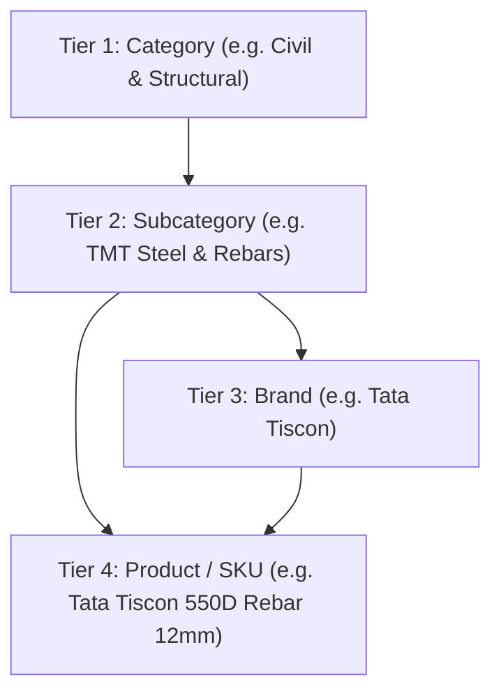
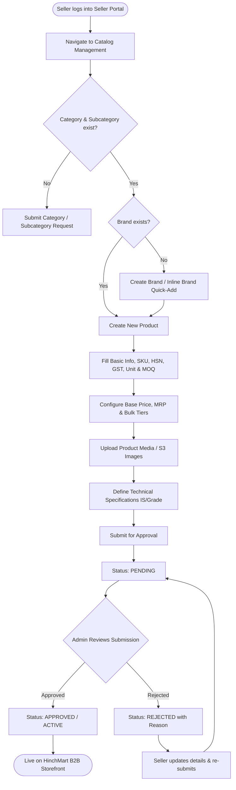
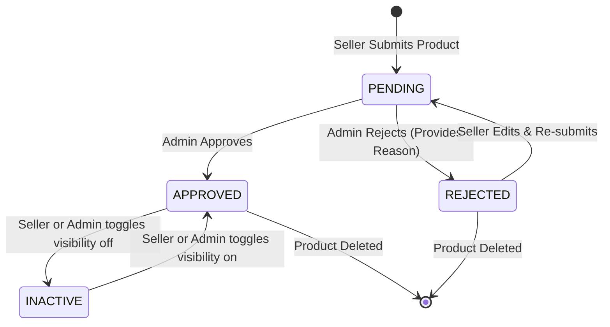

# HINCHMART B2B MARKETPLACE
# Catalog Management Flow & Specification Document
**Target Audience:** Seller Portal Engineering Team, Seller Operations & Onboarding Teams  
**Module:** Catalog Management (`Categories`, `Subcategories`, `Brands`, `Products`)  
**Version:** 2.4.0 (Enterprise B2B)  
**Status:** Production Ready Specification

---

## 1. Executive Overview & Hierarchy Architecture

The HinchMart B2B Marketplace operates on a **4-Tier Structured Catalog Hierarchy**. Every item in the marketplace is strictly anchored to this hierarchy to maintain clean search indexing, accurate category commission calculations, RFQ matching, and smooth bulk procurement.

### 4-Tier Hierarchy Diagram



### Hierarchy Rules & Constraints
1. **Category (L1)**: Top-level industry vertical (Civil, Electrical, Plumbing, Heavy Equipment).
2. **Subcategory (L2)**: Granular product family belonging to exactly **one** Category (`categoryId`).
3. **Brand (L3)**: Manufacturer / trademark entity. A brand can be associated with a specific Category and Subcategory or globally scoped.
4. **Product / SKU (L4)**: The actual purchasable B2B item with pricing tiers, stock, unit of measure, HSN/GST, and specifications. It links to `categoryId`, `subcategoryId`, and `brandId`.

---

## 2. Full Flowchart: Seller Catalog Lifecycle



---

## 3. Tier 1: Category Management Flow

Categories define the top-level marketplace departments.

### 3.1 Category Data Schema
| Field Name | Type | Required | Default | Description / Validation |
|---|---|---|---|---|
| `id` / `categoryId` | Integer / String | Yes (Auto) | DB Gen | Primary unique identifier |
| `name` | String (3-80 chars) | Yes | - | e.g. `"Civil & Structural"`, `"Electrical & Power"` |
| `slug` | String (URL safe) | Yes | Auto-slug | Lowercase, hyphen-separated (e.g. `"civil-structural"`) |
| `description` | String (max 500) | No | `""` | Summary of items contained in this category |
| `sortOrder` / `displayOrder` | Integer | No | `0` | Order of appearance on storefront (1, 2, 3...) |
| `imageUrl` / `imageURL` | String (URL) | No | Fallback | S3 public URL or verified image asset |
| `active` / `isActive` | Boolean | Yes | `true` | Marketplace visibility toggle |

### 3.2 Category Creation / Request Payload
```json
POST /api/categories
{
  "name": "Civil & Structural",
  "slug": "civil-structural",
  "description": "TMT Rebars, Structural Steel, Cement, Ready Mix Concrete & Construction Aggregates.",
  "sortOrder": 1,
  "imageUrl": "https://s3.ap-south-1.amazonaws.com/hinchmart-media/categories/civil-structural.jpg",
  "active": true
}
```

---

## 4. Tier 2: Subcategory Management Flow

Subcategories allow buyers to filter down to exact industrial supplies.

### 4.1 Subcategory Data Schema
| Field Name | Type | Required | Default | Description / Validation |
|---|---|---|---|---|
| `id` / `subcategoryId` | Integer / String | Yes (Auto) | DB Gen | Primary unique identifier |
| `categoryId` | Integer / String | **Yes** | - | Parent Category ID reference |
| `name` | String (3-100 chars)| **Yes** | - | e.g. `"TMT Steel & Rebars"`, `"CPVC Pressure Pipes"` |
| `slug` | String (URL safe) | **Yes** | Auto-slug | e.g. `"tmt-steel-rebars"` |
| `sortOrder` | Integer | No | `0` | Ordering index within parent category |
| `imageUrl` / `imageURL` | String (URL) | No | Fallback | Subcategory icon/banner asset |
| `active` | Boolean | Yes | `true` | Visibility flag |

### 4.2 Subcategory Creation / Request Payload
```json
POST /api/subcategories
{
  "categoryId": 1,
  "name": "TMT Steel & Rebars",
  "slug": "tmt-steel-rebars",
  "sortOrder": 1,
  "imageUrl": "https://s3.ap-south-1.amazonaws.com/hinchmart-media/subcategories/tmt-rebars.jpg",
  "active": true
}
```

---

## 5. Tier 3: Brand Management Flow

Brands represent manufacturer names. Sellers can select existing verified brands or request/add a new brand directly from their portal or inline while adding a product.

### 5.1 Brand Data Schema
| Field Name | Type | Required | Default | Description / Validation |
|---|---|---|---|---|
| `id` / `brandId` | Integer / String | Yes (Auto) | DB Gen | Primary unique identifier |
| `name` | String (2-100 chars)| **Yes** | - | e.g. `"Tata Tiscon"`, `"UltraTech"`, `"Polycab"` |
| `slug` | String (URL safe) | **Yes** | Auto-slug | e.g. `"tata-tiscon"` |
| `categoryId` | Integer / String | No | `null` | Optional parent category linkage |
| `subcategoryId` | Integer / String | No | `null` | Optional subcategory linkage |
| `imageUrl` | String (URL) | No | Logo Presets| Brand Logo URL |
| `sortOrder` | Integer | No | `1` | Sorting order |
| `active` | Boolean | Yes | `true` | Status |

### 5.2 Brand Creation Payload
```json
POST /api/brands
{
  "name": "Tata Tiscon",
  "slug": "tata-tiscon",
  "categoryId": 1,
  "subcategoryId": 1,
  "imageUrl": "https://s3.ap-south-1.amazonaws.com/hinchmart-media/brands/tata-tiscon.png",
  "sortOrder": 1,
  "active": true
}
```

### 5.3 Inline Quick Brand Add (Modal Flow)
When a seller is creating a product and doesn't find their brand in the dropdown:
1. Click **`+ Add New Brand`** next to the brand selector.
2. Enter Brand Name.
3. System auto-generates slug and links current `categoryId`/`subcategoryId`.
4. Returns the newly created Brand ID and automatically selects it in the product form.

---

## 6. Tier 4: Product Management Flow (Comprehensive)

This is the central workflow for sellers. It includes pricing, B2B volume tiers, inventory, units, tax details, technical attributes, and image uploads.

### 6.1 Complete Product Schema Reference

| Field | Type | Mandatory | Example | Validation & Description |
|---|---|---|---|---|
| `name` / `title` | String | **Yes** | `"Tata Tiscon 550D TMT Rebar (12mm)"` | 5 - 200 characters |
| `slug` | String | **Yes** | `"tata-tiscon-550d-tmt-rebar-12mm"` | Lowercase unique alphanumeric slug |
| `sku` | String | **Yes** | `"TATA-TMT-12MM-550D"` | Alphanumeric seller SKU (unique per seller) |
| `categoryId` | Int / String | **Yes** | `1` | Valid Category ID |
| `subcategoryId` | Int / String | **Yes** | `1` | Valid Subcategory ID under Category |
| `brandId` | Int / String | **Yes** | `1` | Valid Brand ID |
| `brand` / `brandName`| String | No | `"Tata Tiscon"` | Display name of the Brand |
| `price` | Number | **Yes** | `54200.00` | Base selling price per unit (> 0) |
| `mrp` | Number | No | `59000.00` | Maximum Retail Price (Must be >= price) |
| `unit` | String (Enum) | **Yes** | `"MT"` | B2B Standard Unit of Measurement |
| `moq` | Integer | **Yes** | `5` | Minimum Order Quantity (>= 1) |
| `stockQty` / `stock` | Number / String| **Yes** | `500` / `"500 MT"` | Available physical inventory |
| `hsn` / `hsnCode` | String | **Yes** | `"7214"` | 4 to 8 digit Indian HSN / SAC code |
| `gstRate` / `gst` | Number / String| **Yes** | `18` / `"18%"` | GST Slab (0%, 5%, 12%, 18%, 28%) |
| `description` | String | **Yes** | `"IS 1786:2008 high ductility rebars..."`| Detailed product description |
| `imageUrl` / `image` | String (URL) | **Yes** | `"https://s3.../img1.jpg"` | Primary display image |
| `images` | Array[String] | No | `["https://s3.../img1.jpg", ...]` | Gallery images (up to 6 images) |
| `bulkPricingTiers` | Array[Object] | No | `[{minQty: 5, price: 54200}]` | Volume discount slabs for B2B buyers |
| `specifications` | Object | No | `{"Grade": "Fe 550D", "Dia": "12mm"}`| Key-Value technical attributes |
| `is24HourDelivery` | Boolean | No | `true` | Express delivery / ready stock badge |
| `sellerId` / `vendorId`| String / Int | **Yes** | `"sel_201"` | ID of the authenticated seller |
| `status` / `approvalStatus`| Enum | System | `"PENDING"` | `PENDING`, `APPROVED`, `REJECTED` |
| `rejectionReason` | String | System | `"Please provide clearer ISI mark image"`| Feedback if rejected by Admin |
| `active` | Boolean | Yes | `true` | Seller's live listing toggle |

---

### 6.2 Supported B2B Units of Measure (`unit`)
The following standardized units are recognized across the platform:
- `MT` (Metric Ton / Ton) - *Civil, Steel, Aggregates*
- `kg` (Kilogram) - *Chemicals, Hardware*
- `gram` (Gram) - *Specialty materials*
- `bag` (Bags e.g. 50kg Cement) - *Cement, Putty*
- `piece` / `unit` (Pcs / Unit) - *Motors, Equipment, Valves*
- `metre` (Metre / Running Metre) - *Pipes, Cables*
- `sq.ft` (Square Feet) - *Plywood, Tiles, Glass*
- `box` / `carton` - *Fasteners, Lighting*
- `bundle` / `roll` - *Binding Wire, Geotextiles*
- `drum` / `cylinder` - *Oils, Gases, Bitumen*

---

### 6.3 B2B Bulk Tiered Pricing Structure (`bulkPricingTiers`)
B2B buyers frequently buy in wholesale volumes. Sellers configure progressive discount slabs:

```json
"bulkPricingTiers": [
  {
    "tierId": 1,
    "minQty": 5,
    "maxQty": 19,
    "price": 54200.00,
    "discountPercentage": 8.1
  },
  {
    "tierId": 2,
    "minQty": 20,
    "maxQty": 99,
    "price": 51200.00,
    "discountPercentage": 13.2
  },
  {
    "tierId": 3,
    "minQty": 100,
    "maxQty": null,
    "price": 48500.00,
    "discountPercentage": 17.8
  }
]
```
*Rule: `minQty` must be >= product `moq`. Subsequent tiers must have strictly increasing `minQty` and decreasing `price`.*

---

### 6.4 Technical Specifications Object (`specifications`)
Dynamic key-value attributes rendered in the product specification table:

```json
"specifications": {
  "Grade": "Fe 550D",
  "Standard Compliance": "IS 1786:2008",
  "Diameter": "12 mm",
  "Bendability": "High Ductility (Mandrel 3D)",
  "Carbon Equivalent": "0.42% Max",
  "Corrosion Resistance": "CRS Grade Treated"
}
```

---

## 7. Media & Image Upload Handling

### 7.1 Image Upload Requirements
- Supported File Formats: `image/jpeg`, `image/png`, `image/webp`, `image/svg+xml`
- Maximum File Size: **5.0 MB** per image
- Minimum Resolution: **600 x 600 px** (Recommended: 1200 x 1200 px on clean white background)
- Direct S3 Storage via Multi-part Upload

### 7.2 Upload API Endpoint
```http
POST /api/images/upload?type=products
Content-Type: multipart/form-data

Form Data:
file: <binary image file>
folder: "products"
```

**Response:**
```json
{
  "success": true,
  "imageUrl": "https://s3.ap-south-1.amazonaws.com/hinchmart-media/products/prod_tmt_12mm_main.jpg",
  "imageKey": "products/prod_tmt_12mm_main.jpg"
}
```

---

## 8. Complete Step-by-Step UI Flow for Sellers

### Step 1: Category & Subcategory Selection (Cascading Dropdowns)
1. Seller selects **Category** (e.g. *Civil & Structural*).
2. The **Subcategory** dropdown immediately filters to display only subcategories under that category (e.g. *TMT Steel Rebars*).
3. The **Brand** dropdown automatically highlights matching brands.

### Step 2: Basic Product Information
1. **Product Name / Title**: Enter descriptive name including size/variant.
2. **Auto Slug**: Automatically generated from title in real-time (can be manually adjusted).
3. **SKU Code**: Seller assigns their warehouse/ERP inventory code.
4. **HSN & GST**: Seller inputs HSN code and chooses applicable GST rate.

### Step 3: Pricing, MOQ & Inventory
1. **Unit**: Select appropriate unit (`MT`, `Pcs`, `Bag`, etc.).
2. **Base Price**: Price per unit excluding or including GST as per portal setting.
3. **MRP**: Recommended retail price (strike-through display).
4. **MOQ**: Minimum quantity a buyer must purchase in one order.
5. **Stock Quantity**: Current available stock.
6. **24-Hour Express Dispatch**: Checkbox if ready for instant shipment.

### Step 4: Bulk Tiers & Technical Specifications
1. Seller clicks `+ Add Tier` to configure volume-based discounts.
2. Seller adds key technical parameters (Standard, Material, Dimensions, Finish).

### Step 5: Images & Media
1. Seller uploads main product image (drag & drop or file picker).
2. Seller uploads up to 5 additional gallery images (angles, dimension drawings, test certificates).

### Step 6: Submission & Status Tracking
1. Click **`Submit Product`**.
2. Product is saved in database with status `"PENDING"`.
3. Seller can track review progress in **`My Catalog > Submissions`**.

---

## 9. Product Approval & Review State Machine



### Status Definitions
| Status | Meaning | Marketplace Visibility | Allowed Actions |
|---|---|---|---|
| `PENDING` | Awaiting Admin verification | Hidden | Seller can edit; Admin can Approve/Reject |
| `APPROVED` | Approved by HinchMart Quality Team | Live (if active = true) | Seller can edit price/stock; Toggle active |
| `REJECTED` | Disapproved due to policy/data issues | Hidden | Seller can view reason, modify & re-submit |
| `INACTIVE` | Temporarily delisted by seller/admin | Hidden | Seller can toggle back to Active |

---

## 10. Complete Seller API Endpoints & Payloads

### 10.1 List Seller's Products
```http
GET /api/seller/products?page=1&limit=20&status=ALL&search=Tata
Authorization: Bearer <SELLER_JWT_TOKEN>
```
**Response:**
```json
{
  "products": [
    {
      "id": 101,
      "productId": 101,
      "name": "Tata Tiscon 550D TMT Rebar (12mm)",
      "sku": "TATA-TMT-12MM-550D",
      "price": 54200.00,
      "mrp": 59000.00,
      "stockQty": 500,
      "unit": "MT",
      "moq": 5,
      "categoryId": 1,
      "categoryName": "Civil & Structural",
      "subcategoryId": 1,
      "subcategoryName": "TMT Steel & Rebars",
      "brandId": 1,
      "brandName": "Tata Tiscon",
      "imageUrl": "https://s3.ap-south-1.amazonaws.com/hinchmart-media/products/tata-tmt-12mm.jpg",
      "status": "APPROVED",
      "active": true,
      "createdAt": "2026-09-08T10:00:00.000Z"
    }
  ],
  "total": 1,
  "page": 1,
  "totalPages": 1
}
```

---

### 10.2 Create New Product (Seller Submission)
```http
POST /api/seller/products
Content-Type: application/json
Authorization: Bearer <SELLER_JWT_TOKEN>

{
  "name": "Tata Tiscon 550D TMT Rebar (12mm)",
  "slug": "tata-tiscon-550d-tmt-rebar-12mm",
  "sku": "TATA-TMT-12MM-550D",
  "categoryId": 1,
  "subcategoryId": 1,
  "brandId": 1,
  "price": 54200.00,
  "mrp": 59000.00,
  "unit": "MT",
  "moq": 5,
  "stockQty": 500,
  "hsn": "7214",
  "gstRate": 18.0,
  "description": "High-ductility earthquake resistant primary steel rebars conforming to IS 1786:2008 standards.",
  "imageUrl": "https://s3.ap-south-1.amazonaws.com/hinchmart-media/products/tata-tmt-12mm.jpg",
  "images": [
    "https://s3.ap-south-1.amazonaws.com/hinchmart-media/products/tata-tmt-12mm.jpg",
    "https://s3.ap-south-1.amazonaws.com/hinchmart-media/products/tata-tmt-12mm-testcert.jpg"
  ],
  "bulkPricingTiers": [
    { "minQty": 5, "maxQty": 19, "price": 54200.00, "discountPercentage": 8.1 },
    { "minQty": 20, "maxQty": null, "price": 51200.00, "discountPercentage": 13.2 }
  ],
  "specifications": {
    "Grade": "Fe 550D",
    "Standard": "IS 1786:2008",
    "Diameter": "12 mm"
  },
  "is24HourDelivery": true,
  "active": true
}
```

**Response (201 Created):**
```json
{
  "success": true,
  "message": "Product submitted successfully and is under review.",
  "data": {
    "id": 101,
    "productId": 101,
    "status": "PENDING",
    "approvalStatus": "PENDING",
    "name": "Tata Tiscon 550D TMT Rebar (12mm)",
    "sku": "TATA-TMT-12MM-550D",
    "createdAt": "2026-09-08T10:30:00.000Z"
  }
}
```

---

### 10.3 Update Existing Product
```http
PUT /api/seller/products/101
Content-Type: application/json
Authorization: Bearer <SELLER_JWT_TOKEN>

{
  "price": 53900.00,
  "stockQty": 650,
  "bulkPricingTiers": [
    { "minQty": 5, "maxQty": 19, "price": 53900.00, "discountPercentage": 8.5 },
    { "minQty": 20, "maxQty": null, "price": 50900.00, "discountPercentage": 13.7 }
  ]
}
```

---

### 10.4 Toggle Product Active / Inactive
```http
PATCH /api/seller/products/101/toggle-active
Authorization: Bearer <SELLER_JWT_TOKEN>

{
  "active": false
}
```

---

### 10.5 Delete Product
```http
DELETE /api/seller/products/101
Authorization: Bearer <SELLER_JWT_TOKEN>
```

---

## 11. Validation Rules & Guardrails Matrix

| Field | Rule | Error Message if Violated |
|---|---|---|
| `name` | String length between 5 and 200 | `"Product name must be between 5 and 200 characters"` |
| `sku` | Alphanumeric, hyphen, underscore (3-50 chars) | `"SKU must contain only letters, numbers, and hyphens"` |
| `price` | Number > 0 | `"Base price must be greater than 0"` |
| `mrp` | Number >= `price` | `"MRP cannot be less than the selling price"` |
| `moq` | Integer >= 1 | `"MOQ must be at least 1"` |
| `stockQty` | Number >= 0 | `"Stock quantity cannot be negative"` |
| `categoryId` | Must exist in Category database | `"Please select a valid category"` |
| `subcategoryId` | Must belong to selected `categoryId` | `"Selected subcategory does not belong to the category"` |
| `hsn` | 4 to 8 numeric digits | `"Please enter a valid 4 to 8 digit HSN code"` |
| `gstRate` | One of `[0, 5, 12, 18, 28]` | `"Invalid GST rate percentage"` |
| `imageUrl` | Valid HTTPS URL | `"Please upload a valid primary product image"` |
| `bulkPricingTiers` | `minQty` >= `moq`, strictly ascending | `"Tier quantities must be progressive and start from MOQ"` |

---

## 12. Handover Checklist for the Seller Team

- [x] **Hierarchical Cascading**: Category -> Subcategory -> Brand dropdown linkage is clearly mapped.
- [x] **Inline Brand Creation**: Sellers can add missing brands on the fly without breaking the workflow.
- [x] **Units & HSN/GST Standards**: Complete B2B unit list and tax standards documented.
- [x] **Volume Pricing Support**: Structure and calculation for B2B bulk pricing tiers defined.
- [x] **Image Asset Handling**: Direct S3 upload guidelines, formats, and fallback rules included.
- [x] **Approval Workflow**: States (`PENDING`, `APPROVED`, `REJECTED`, `INACTIVE`), transitions, and rejection feedback flow documented.
- [x] **API Contracts**: JSON schemas and endpoints for all CRUD operations provided.
- [x] **Zero Code Disturbance**: Existing admin codebase untouched and fully intact.

---
*Document prepared for HinchMart Engineering & Seller Operations.*
